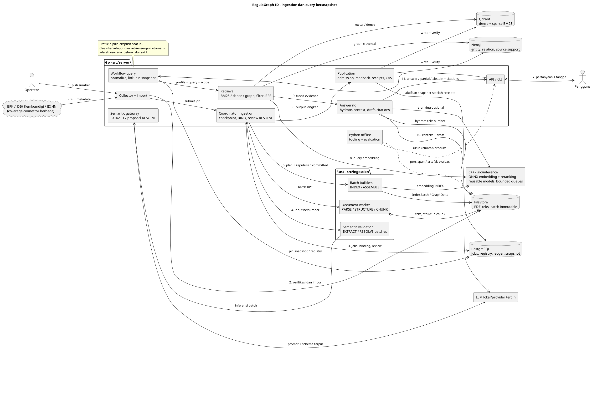

# RegulaGraph-ID

RegulaGraph-ID adalah proyek **Hybrid GraphRAG untuk regulasi Indonesia**. Sistem mengubah PDF dan metadata sumber menjadi chunk berbasis struktur, identitas regulasi/pasal yang konsisten, indeks lexical dan dense, serta knowledge graph dengan bukti sumber. Pertanyaan dicari pada snapshot corpus yang sama, lalu evidence disusun menjadi konteks bagi model untuk menghasilkan jawaban berkutipan. README ini menjelaskan arsitektur, batas komponen, pilihan teknologi, struktur proyek, dan operasi lokal.

Masalah yang ditangani adalah regulasi yang tersebar, saling merujuk, mempunyai perubahan versi, dan memakai istilah berbeda untuk hal yang sama. Nilai produknya adalah mempercepat penelusuran sambil membuat sumber jawaban dapat diperiksa sampai teks/pasalnya. Keberadaan kutipan sendiri belum membuktikan kebenaran hukum.

**Status:** collector/import, pipeline dokumen, native embedding/reranking, registry/resolution, graph assembly/publication, empat profil retrieval, serta draft jawaban lokal CLI/API mempunyai implementasi. Integrasi backend/native sudah diuji pada fixture; PDF hasil akuisisi nyata sudah melewati PARSE → STRUCTURE → BIND → CHUNK. CLI bootstrap migration tersedia; EXTRACT kini menyertakan vocabulary ontology terpin dan menolak perbedaan pin pada job/output. Uji model lokal seluruh PDF belum lulus (timeout dan keluaran model invalid), sehingga tidak dihitung sebagai keberhasilan extraction. Acceptance corpus nyata, gold quality, seluruh target performa, dan beberapa fitur lanjutan **belum selesai**. Lihat [rencana terkini](doc/development-plan.md) dan [verifikasi PDF nyata](doc/verification-report-real-pdf.md).

**Untuk mencoba sekarang:** [demo lokal](#menjalankan-demo-lokal) tersedia tanpa database. [Pipeline GraphRAG lengkap](#menjalankan-pipeline-graphrag-lokal) membutuhkan backend, model terpin, dan corpus yang sudah dipublikasikan.

## Arsitektur dan urutan kerja

Go memiliki workflow, otoritas registry, serta commit/publication; Rust mengerjakan transformasi batch; C++ menjalankan embedding/reranking; Python dipakai offline. Diagram menunjukkan dependency logis, bukan satu RPC untuk setiap panah. Kontrak Protobuf C01 membawa identitas, versi, snapshot, producer, status, dan byte offset UTF-8 lintas runtime.



GitHub tidak merender blok PlantUML secara native; salin blok ke renderer PlantUML untuk melihat diagram. Desain lengkap: [system design](doc/system-design.md), [kontrak](doc/system-contracts.md), [storage consistency](doc/storage-consistency.md).

### Kronologi ingestion

| Tahap / komponen | Input → proses → output | Pemilik / lokasi | Peran dan integrasi |
| --- | --- | --- | --- |
| 1. Acquisition | URL katalog/detail → HTML, metadata, download/hash PDF → record/receipt + blob | Go `internal/ingestion/sources` | Menghindari download manual; resume/audit mempertahankan asal data. Coverage JDIHN belum lengkap. |
| 2. Import/submit | Record lengkap + PDF → salin immutable, register, enqueue → job PARSE | Go `workflows/acquisition_import.go`, `cmd/cli/submit_acquisition.go` | Acquisition root berbeda dari artifact store. Metadata portal belum menjadi keputusan canonical. |
| 3. PARSE/STRUCTURE | PDF → PDFium, normalisasi dengan mapping, hierarki → text/structure batch | Rust `document/parsing`, `normalization`, `chunking/structural.rs` | Pertahankan halaman, byte sumber, pasal/ayat/butir. OCR/layout sulit memerlukan jalur tambahan. |
| 4. BIND/CHUNK | Struktur + metadata → registry identity/version → chunk, parent context, token count | Go `domain/registry.go`, `workflows/bind.go`; Rust `document/chunking` | Nomor regulasi dibaca bersama issuer/type/year. Chunk merujuk versi dan span nyata. |
| 5. EXTRACT | Chunk + ontology → LLM usulkan mention/assertion → batch tervalidasi | Go semantic gateway; Rust `knowledge_graph/extraction` | Prompt memberi reasoning; validator memeriksa schema, evidence, ontology dan manifest. |
| 6. RESOLVE/review | Mention + kandidat + konteks → proposal LINK/DEFER, review → keputusan committed | Go `workflows/semantic_resolution*`, PostgreSQL; Rust `knowledge_graph/resolution` | Alias sama belum tentu satu entitas. Model membantu ambiguitas; authority pada registry. CREATE/MERGE/SPLIT lengkap masih terbuka. |
| 7. Persiapan indeks | Pilihan CHUNK → snapshot, vocabulary, dictionary, statistik → IndexBuildPlan | Go `indexing`; Rust `indexing` | Populasi statistik harus sama dengan sumber; model/analyzer/dictionary dipin sebelum INDEX. |
| 8. INDEX/ASSEMBLE | Plan + chunk/keputusan → dense/sparse atau graph delta → batch immutable | Rust `indexing`, `knowledge_graph/assembly`; C++ inference | Graph dirakit dari fakta dan keputusan tervalidasi. Extraction tidak diulang saat query. |
| 9. Publication | Seluruh child selesai → validate, backend write/readback, receipts → active snapshot | Go `internal/indexing`, adapters PostgreSQL/Qdrant/Neo4j | Data parsial tidak boleh aktif. Ledger, fence, replay dan CAS mengoordinasikan storage; bukan transaksi atomik lintas database. |

### Kronologi query

| Tahap / komponen | Input → proses → output | Lokasi utama | Alasan / batas saat ini |
| --- | --- | --- | --- |
| 1. Admission | Pertanyaan + corpus/tanggal → validasi auth/budget/profile → context | `server/internal/api`, `config` | Scope tepercaya dari server. API menerima AS_OF eksplisit; CURRENT/COMPARE dan streaming belum aktif. |
| 2. Preparation | Context → pin snapshot, normalize, lexical/entity lookup → query plan | `workflows`, `retrieval/query` | Satu jawaban memakai view corpus konsisten. Profile eksplisit, belum classifier factual/relational otomatis. |
| 3. Retrieval | Plan → dense/BM25/graph sesuai profil → kandidat bersumber | `retrieval`, `retrieval/graph`, adapters | Dense untuk parafrasa, BM25 nomor/istilah eksak, graph hubungan antar dokumen. |
| 4. Filter/fusion | Kandidat + scope/versi → filter, dedup evidence/version, RRF → ranking | `retrieval/fusion.go`, domain boundaries | Raw score antar mesin beda skala. Filter tanggal tidak berarti semua perubahan hukum sudah dimodelkan. |
| 5. Hydrate/rerank | Ranking → teks asli + rerank opsional → evidence terurut | `workflows/rag_hydration.go`, `retrieval/reranking.go`, C++ | Cross-encoder lebih mahal; opsional di CLI, konfigurasi reranking API belum tersambung. |
| 6. Context | Evidence + parent + token budget → prompt bersumber | `answering/context_builder.go` | Pertahankan konteks induk dan ukur kelengkapan bukti bersama latency. |
| 7. Generation/validation | Prompt → draft klaim/citation → validasi referensi dan dukungan yang tersedia | `answering`, adapters inference, `workflows/answer.go` | Hasil draft/PARTIAL/ABSTAIN; validitas citation struktural belum membuktikan entailment seluruh klaim. |
| 8. Response/evaluation | Hasil + evidence/status → API/CLI dan metrik | `api`, `cmd/cli`, `evaluation` | Sumber dapat diperiksa. Retrieve-again otomatis dan acceptance kualitas penuh masih terbuka. |

**Pengganti LangGraph adalah workflow Go eksplisit.** Jalur request menyusun komponen dalam proses yang sama; ingestion memakai job/checkpoint PostgreSQL dan worker batch. Ini mengurangi boundary pada jalur latency kritis, dengan biaya membangun state transition, retry, tracing dan recovery sendiri.

## Pemilihan teknologi dan alasan

| Teknologi | Fungsi | Alasan pemilihan | Trade-off / alternatif |
| --- | --- | --- | --- |
| Go | API/CLI, workflow, retrieval, answering, adapters | Concurrency I/O dan pool reusable; fusion/filter/context satu proses | Orchestration perlu dibangun sendiri; FastAPI/LangGraph lebih kaya untuk prototyping. Bahasa saja tidak menjamin cepat. |
| Rust | Transform dokumen/graph/indeks batch | Kontrol memori, ownership dan pekerjaan CPU | Build/interop lebih rumit daripada Python; engine PDF tetap memakai library native. |
| C++ + ONNX Runtime | BGE-M3 embedding dan BGE cross-encoder | Session reusable, CPU/CUDA, batching/admission | SDK/ABI/export model harus dipin; alternatif inference server perlu dibandingkan pada workload sama. |
| PDFium + tokenizer Rust | PDF text layer dan token count nyata | Engine PDF matang; token budget selaras tokenizer model | OCR, tabel dan reading order tidak otomatis selesai. |
| Python offline | Corpus/model tooling, evaluation | Ekosistem ML/analisis tanpa dependency Python pada serving | Memelihara beberapa bahasa dan kontrak bersama. |
| PostgreSQL | Jobs, registry, versi, review, publication ledger | Transaksi/constraints dan audit durable | Locking/query perlu profiling; bukan mesin traversal/vector pada desain ini. |
| Qdrant | Dense dan sparse BM25 | Dua representasi pencarian dan filter metadata | Generation/payload harus konsisten dengan registry; pgvector/OpenSearch mengubah pembagian fungsi. |
| Neo4j | Entity/relation/support dan traversal | Relasi dan path antar regulasi dapat diperiksa | Tambahan backend; graph berguna jika extraction/resolution dan buktinya benar. |
| BM25 + dense + RRF | Pencarian eksak dan semantik | Nomor pasal, istilah, parafrasa; fusion ranking beda skala | Cost kandidat/panggilan bertambah; hybrid tidak otomatis lebih akurat. |
| Cross-encoder | Reranking kandidat | Interaksi query-teks lebih rinci | Cost mengikuti jumlah/panjang pasangan; logit bukan confidence terkalibrasi. |
| LLM + validator | Extraction, resolusi ambigu, draft | Reasoning kontekstual tanpa hardcode semua variasi bahasa | Risiko salah fakta/cost/nondeterminisme; evidence, model pin, review dan evaluasi diperlukan. |
| Protobuf/gRPC | Boundary dan artefak C01 | Schema/ID/producer/status sama lintas runtime | Codegen dan kompatibilitas perlu dijaga; bukan RPC per helper kecil. |
| Immutable FileStore | PDF, teks, batch, manifests | Hash verification, replay dan audit | Kapasitas, backup, retensi dan orphan cleanup perlu dikelola. |
| Docker/Compose (rencana) | Packaging/deployment | Reproduksi dependency nantinya | Compose masih `services: {}`; belum stack deploy siap jalan. |

BGE dan LLM yang diuji adalah kandidat implementasi, bukan klaim model terbaik untuk release. Pemilihan akhir membutuhkan corpus/split/workload tetap dan pengukuran quality/latency.

## Struktur proyek

Tree mencakup **seluruh folder komponen yang dikelola**, ditambah file konfigurasi/entry point utama. Setiap child yang ditampilkan mempunyai deskripsi di kanan. Semua folder komponen mempunyai README.md, tidak diulang pada setiap baris. Implementasi/test individual yang banyak dirinci melalui README anak; ini bukan daftar setiap file kode.

```text
RegulaGraph-ID/                              # Monorepo runtime, kontrak, tooling dan evaluasi
|-- .vscode/                                # Pengaturan editor workspace
|   `-- settings.json                       # Preferensi editor proyek
|-- src/                                    # Kode produk dan kontrak bersama
|   |-- server/                             # Runtime Go; serving dan otoritas storage
|   |   |-- go.mod / go.sum                  # Dependency/checksum module Go
|   |   |-- cmd/                            # Composition root executable
|   |   |   |-- api/                        # main.go: bootstrap HTTP evidence/draft answer
|   |   |   |-- cli/                        # Migrate, collect, submit, prepare/publish, query, demo
|   |   |   |-- ingestion-worker/           # Daemon coordinator lease/retry/checkpoint
|   |   |   `-- semantic-gateway/           # Gateway model EXTRACT/RESOLVE terstruktur
|   |   |-- internal/                       # Komponen privat server
|   |   |   |-- domain/                     # Identitas, invariants, validasi dan DTO domain
|   |   |   |-- config/                     # Admission konfigurasi dan model pin
|   |   |   |-- api/                        # Transport HTTP, middleware, response/error
|   |   |   |   |-- routes/                 # Routing endpoint
|   |   |   |   `-- schemas/                # Mapping/validasi request-response HTTP
|   |   |   |-- ingestion/                 # Akuisisi dan persiapan sumber Go
|   |   |   |   `-- sources/               # Connector, discovery, download, audit/receipt
|   |   |   |-- workflows/                 # Urutan use case lintas domain/adapter
|   |   |   |-- indexing/                  # Inventory, write/readback dan publication
|   |   |   |-- retrieval/                 # Dense/lexical orchestration, fusion/reranking
|   |   |   |   |-- query/                 # Normalisasi, analyzer, entity linking query
|   |   |   |   `-- graph/                 # Discovery/traversal dan graph evidence
|   |   |   |-- answering/                 # Context, generation, citation, abstention
|   |   |   `-- adapters/                  # Implementasi port dependency eksternal
|   |   |       |-- inference/             # Client native/LLM dan admission output
|   |   |       |-- neo4j/                 # Graph read/write/generation/verification
|   |   |       |-- postgres/              # Registry, jobs, migrasi, ledger, snapshot
|   |   |       |-- qdrant/                # Collection, dense/sparse write/search/readback
|   |   |       |-- storage/               # FileStore/hash dan akses artefak terkurung
|   |   |       `-- worker/                # Client batch gRPC Rust
|   |   `-- gen/regulagraph/v1/             # Binding Go generated; edit schema asal
|   |-- ingestion/                         # Runtime Rust; transformasi batch
|   |   |-- Cargo.toml                      # Manifest crate ingestion
|   |   |-- src/                            # Library dan worker
|   |   |   |-- lib.rs                      # Ekspor modul; tanpa membuka model/koneksi
|   |   |   |-- bin/                        # Entry point worker dan lexical tooling
|   |   |   |   |-- regulagraph-worker.rs    # Bootstrap layanan batch Tonic
|   |   |   |   `-- regulagraph-lexical.rs   # Vocabulary dan statistik BM25
|   |   |   |-- adapters/                   # Boundary PDF/storage/inference Rust
|   |   |   |-- domain/                     # Tipe/invariant transformasi
|   |   |   |-- document/                   # PDF menjadi teks/struktur/versi sumber
|   |   |   |   |-- parsing/                # PDF text layer dan interface parser
|   |   |   |   |-- normalization/          # Mapping byte raw-normalized
|   |   |   |   |-- chunking/               # Struktur, parent context, split, token count
|   |   |   |   `-- versioning/             # Transform versi/relasi perubahan
|   |   |   |-- knowledge_graph/            # Fakta bersumber menjadi graph batch
|   |   |   |   |-- extraction/             # Ekstraksi model dan admission bukti
|   |   |   |   |-- resolution/             # Kandidat/keputusan identitas dalam batch
|   |   |   |   |-- assembly/               # Node/edge/support dan GraphDelta
|   |   |   |   |-- validation/             # Gate ontology/graph/provenance
|   |   |   |   `-- summarization/          # Cakupan ringkasan graph; status di README anak
|   |   |   |-- indexing/                   # Analyzer/dictionary/statistik/dense-sparse
|   |   |   `-- worker/                     # RPC dispatch, cancellation, output checkpoint
|   |   `-- tests/                          # Pengujian integrasi crate Rust
|   |-- inference/                         # Runtime native embedding/reranking
|   |   |-- CMakeLists.txt                  # Build C++ dan opsi ONNX
|   |   |-- include/                        # Header publik C++
|   |   |   `-- regulagraph/                # Namespace proyek
|   |   |       `-- inference/              # API runtime/batching/embedding/reranker
|   |   |-- src/                            # Implementasi C++, server dan native tests
|   |   `-- tokenizer/                     # Tokenizer Rust melalui C ABI C++
|   `-- contracts/                         # Sumber schema lintas bahasa
|       |-- schema-lock.json               # Baseline kompatibilitas C01
|       |-- jsonschema/                    # Structured output model/extraction/resolution
|       `-- proto/                         # Protobuf source of truth
|           `-- regulagraph/               # Namespace kontrak
|               `-- v1/                    # Documents/graph/jobs/evidence/inference/answers
|-- configs/                               # Konfigurasi versioned dan kebijakan bersama
|   |-- prompts/                           # Prompt model terpin versi/hash
|   |-- benchmark-targets.yaml             # Satu sumber angka required benchmark
|   |-- ontology-v1.jsonc                  # Entity/predicate/qualifier yang diizinkan
|   |-- sources.txt / listings.txt         # Seed detail/katalog sumber resmi
|   `-- demo.Modelfile                     # Profil Ollama demo
|-- migrations/                            # SQL versioned untuk control-plane
|-- deployment/                            # Packaging/wiring deployment yang direncanakan
|   `-- docker-compose.yml                 # Services kosong; belum startup stack
|-- evaluation/                            # Evaluasi offline keluaran produksi
|   |-- runner.py                          # Eligibility, run bundle, required gates
|   |-- datasets/                          # Schema/loader/gold annotation; bukan raw corpus
|   |-- experiments/                       # Profil dan konfigurasi perbandingan
|   `-- metrics/                           # Retrieval/graph/answer/citation/runtime
|-- tooling/                               # Alat offline corpus/model
|   |-- corpus/                            # Demo sample, corpus profile, gold/review queue
|   `-- models/                            # Download/export/parity bundle inference
|-- tests/                                 # Verifikasi lintas komponen/bahasa
|   |-- fixtures/                          # Input deterministik dan kasus negatif
|   |-- unit/                              # Python tooling/evaluation unit tests
|   |-- integration/                       # Wire dan integrasi runtime
|   `-- end_to_end/                        # Alur menyeluruh dan acceptance
|-- scripts/                               # Build, codegen dan pemeriksaan repo
|   |-- start_demo.ps1                      # Start preview foreground
|   |-- build_native.ps1                    # Build inference dengan SDK operator
|   |-- generate_contracts.py              # Generate binding dari Protobuf
|   `-- check_contracts.py                 # Periksa kompatibilitas baseline
|-- doc/                                   # Desain, panduan operasi, bukti verifikasi
|   |-- decisions/                         # Keputusan arsitektur dan trade-off historis
|   |-- interview/                         # Penjelasan flow, math, architecture, code map
|   |-- architecture.md                    # Arsitektur terperinci
|   |-- development-plan.md                # Status milestone dan dependency kerja
|   |-- verification.md                    # Protokol verifikasi input/proses/output
|   `-- benchmark-policy.md                # Aturan acceptance/perubahan target
|-- data/                                  # Input/corpus lokal dan metadata acquisition
|-- artifacts/                             # Hasil run, model, ekspor, bukti verifikasi
|-- .env.example                           # Referensi env; .env tidak auto-load
|-- .gitignore                             # Secret/corpus/cache/build dikecualikan
|-- AGENTS.md                              # Aturan cakupan/dokumentasi/verifikasi
|-- PLAN.MD                                # Rencana awal; status di development-plan
|-- Cargo.toml / Cargo.lock                # Workspace Rust dan lockfile
|-- go.work / go.work.sum                   # Workspace Go dan checksum
|-- pyproject.toml                         # Packaging Python offline
`-- README.md                              # Panduan utama
```

Folder lokal yang muncul saat run: `data/acquisition/{records,blobs,...}` berisi hasil collector; `artifacts/interview-demo` ekspor demo; `artifacts/models` bobot/manifests; `artifacts/verification/<run-id>` bukti; `.cache` dependency/build lokal; `target` hasil Cargo. Isinya tidak semuanya dilacak Git. Binding `gen` adalah generated output.

`data` tetap diperlukan untuk input/corpus operasional; `evaluation/datasets` memiliki kontrak dan data penilaian berlabel. Daftar setiap file tracked aktual: `git ls-files`. README anak mendefinisikan cakupan, integrasi dan status; keberadaan folder bukan klaim semua rencananya selesai. Baca [AGENTS.md](AGENTS.md) sebelum menambah komponen.

## Menjalankan demo lokal

Semua contoh PowerShell dari root repo. Demo adalah **BM25 + draft LLM pada PDF nyata**, tanpa Neo4j/Qdrant/Rust chunker/C++ embedding di jalur request.

### Prasyarat dan start

Pasang Go sesuai `go.work` (Go 1.26, toolchain 1.26.8), Python 3.11+, dan siapkan record/PDF collector lengkap di `data/acquisition`. Untuk generation, jalankan Ollama dengan `qwen2.5:7b`; SearchOnly tidak memerlukan model.

```powershell
python -m pip install -e .
# Hanya jika bobot belum tersedia; membutuhkan internet.
ollama pull qwen2.5:7b
powershell -ExecutionPolicy Bypass -File scripts/start_demo.ps1
```

Buka **http://127.0.0.1:8096**. Script menyiapkan sample sekali, membangun Go dan menjalankan server foreground. Jika Ollama belum aktif, jalankan aplikasinya atau `ollama serve` pada terminal terpisah. Pencarian tanpa generation:

```powershell
powershell -ExecutionPolicy Bypass -File scripts/start_demo.ps1 -SearchOnly
```

Contoh: “Apa saja hak subjek data pribadi?” Pastikan dokumen relevan masuk sample. UI menunjukkan evidence/PDF; hasil model adalah draft. Script memakai ulang proses aktif dengan mode sama, sehingga perubahan kode memerlukan stop/start.

### Rebuild sample dan stop

Gunakan output baru agar PDF asli dan sample lama tetap tersedia. Ini memproses unduhan lokal, tidak mengunduh ulang:

```powershell
python -m tooling.corpus.prepare_demo --acquisition data/acquisition --out artifacts/interview-demo-v2 --documents 24 --max-pages 150
go run ./src/server/cmd/cli demo -corpus artifacts/interview-demo-v2 -acquisition data/acquisition -listen 127.0.0.1:8096 -model regulagraph-demo:latest
```

Stop server sebelumnya bila port sama. Periksa `report.json` dan `SHA256SUMS`; dokumen skip tetap tercatat. Script start memakai folder default; sample alternatif memakai CLI di atas. Ukuran sample bukan workload benchmark.

**Ctrl+C** pada terminal server menghentikannya. Untuk background, cocokkan PID **dan path executable** sebelum `Stop-Process -Id <PID>`; jangan kill semua Go/Ollama. Menutup browser tidak mematikan server. Detail: [demo lokal](doc/interview-demo.md).

## Akuisisi dan audit corpus

Sumber pilihan adalah BPK, JDIH Kemkomdigi, JDIHN Nasional. Coverage berbeda; search dinamis/PDF anggota JDIHN belum diverifikasi lengkap.

```powershell
# Opsional: daftar URL lebih dahulu tanpa download PDF.
go run ./src/server/cmd/cli discover -input configs/listings.txt -max-pages 200 -interval 1s -out data/acquisition
# Pilih seed detail atau queue hasil discover.
go run ./src/server/cmd/cli collect -input configs/sources.txt
# Alternatif: collect -input data/acquisition/queue.txt
go run ./src/server/cmd/cli audit -out data/acquisition -workers 8
```

Collector menyimpan PDF aktual, metadata, receipt dan hash; run ulang mendukung resume. `-refresh` memeriksa sumber kembali, tidak diperlukan hanya untuk rebuild indeks. Gunakan satu penulis per acquisition root. Periksa incomplete/error/deferred, bukan sekadar keberadaan PDF. Opsi cap/retry dan batas connector: [acquisition](doc/acquisition.md).

## Menjalankan pipeline GraphRAG lokal

Jalur ini **belum satu command dari checkout bersih**. Operator menyiapkan backend, migrasi, model/prompt/ontology terpin dan source inventory. Compose belum menjalankan dependency. Placeholder `<...>` harus diisi nilai/artefak nyata, bukan hash fixture.

### 1. Build dan dependency

```powershell
go build ./src/server/...
cargo fetch --locked
cargo build -p regulagraph-ingestion --bins --locked
# SDK/path disediakan operator.
./scripts/build_native.ps1 -OrtRoot .cache/ort-wheel-sdk -DependencyPrefixes .cache/protobuf-install,.cache/grpc-install -Protoc .cache/contracts-tools/protoc/bin/protoc.exe
```

C++ membutuhkan C++17, CMake 3.20+, protobuf/protoc 34.1, gRPC 1.76 dan ONNX Runtime 1.22.0 dengan ABI sesuai. Script native memakai Cargo offline setelah cache diisi. Build CMake default tanpa model runtime bukan layanan embedding lengkap. Export/bundle BGE, manifest, tokenizer dan argumen runtime: [native inference](doc/native-inference.md). Bobot tidak ikut Git.

Siapkan PostgreSQL, Qdrant dan Neo4j lokal. Terapkan [migrasi](migrations/README.md) berurutan sebelum runtime; jalankan `go run ./src/server/cmd/cli migrate -dir migrations -timeout 5m` dengan `REGULAGRAPH_POSTGRES_DSN` yang sesuai. Command memakai runner checksum/advisory-lock dan transaksi per file; replay tidak menggandakan perubahan. Tidak ada reset/down otomatis. Database test harus terpisah. Konfigurasi ada di [.env.example](.env.example); **.env tidak otomatis dibaca**. Set `$env:...` pada terminal masing-masing proses; jangan commit credential.

### 2. Startup ingestion dan model

| Urutan | Perintah / panduan | Dependency yang harus cocok |
| --- | --- | --- |
| Native inference | Executable C++ hasil build; [argumen](doc/native-inference.md) | Model manifests/hash, CPU/CUDA, port; model dimuat sekali |
| Semantic gateway + LLM | `go run ./src/server/cmd/semantic-gateway`; [gateway](src/server/cmd/semantic-gateway/README.md) | Endpoint, model/version/weights/tokenizer, prompt/schema/ontology, budget |
| Rust worker | `target/debug/regulagraph-worker.exe`; [worker](src/ingestion/src/worker/README.md) | PDFium library/hash/version, tokenizer/hash, artifact root, semantic/native endpoint/manifests |
| Go coordinator | `go run ./src/server/cmd/ingestion-worker`; [coordinator](src/server/cmd/ingestion-worker/README.md) | DSN, worker endpoint, shared root, owner/scope, ontology, candidate policy, build/jurisdiction |

Go `REGULAGRAPH_ARTIFACTS_DIR` dan Rust `REGULAGRAPH_WORKER_ARTIFACT_ROOT` menunjuk store sama. Go `REGULAGRAPH_WORKER_ENDPOINT` cocok dengan listener Rust. RESOLVE/INDEX/ASSEMBLE diaktifkan eksplisit; flag tidak membuat inventory/publication sendiri. Jalankan foreground di terminal terpisah. Model lokal tidak memerlukan cloud API key; backend yang dilindungi tetap perlu credential lokal.

### 3. Import dan proses sumber

```powershell
go run ./src/server/cmd/cli submit -request data/ingestion-request.json -job-id job:document-example -acquisition-record data/acquisition/records/RECORD_HASH.json -acquisition-root data/acquisition
```

IngestionRequest ProtoJSON memuat corpus, operation INGEST, idempotency key dan producer nyata; sources/observations kosong diisi importer. Siapkan sesuai [kontrak impor](doc/acquisition-import.md). Coordinator menjalankan PARSE → STRUCTURE → BIND → CHUNK → EXTRACT. Konflik metadata/identity membutuhkan review. Graph memerlukan RESOLVE dan keputusan review: [resolution](doc/semantic-resolution.md), [review](doc/semantic-review.md). Submit sukses berarti job durable, belum search-ready.

### 4. Indeks dense/BM25

Urutan: **CHUNK committed → prepare-snapshot → vocabulary → prepare-dictionary → freeze → prepare-index → seluruh INDEX STAGED → publish-index**.

```powershell
go run ./src/server/cmd/cli prepare-snapshot -corpus corpus:example -publication publication:example -generation generation:example -auth-scope operator:corpus -source 'job:document=artifact:document-batch:HASH' -out artifacts/preparation-example
# Jalankan vocabulary/dictionary/freeze pada snapshot.pb dan seluruh source-*.pb.
# prepare-index memakai dictionary/statistics refs serta model manifest terpin.
# Tunggu seluruh child INDEX STAGED.
go run ./src/server/cmd/cli publish-index -corpus corpus:example -publication publication:example -profile hybrid
```

Command lengkap dua pass di [lexical-population](doc/lexical-population.md); `prepare-index`, binary `embedding-model.pb`, scheduling/retry di [index-source-publication](doc/index-source-publication.md). Seluruh pass memakai populasi/snapshot sama. Rust memerlukan native endpoint dan binary model manifest/hash; Go memerlukan `REGULAGRAPH_INDEX_ENABLED=true`. Publication ini mengaktifkan dense/BM25, belum graph.

Contoh pengisian langkah tengah untuk **satu** source yang dipilih di atas
(untuk banyak sumber ulangi `--source-ref` pada vocabulary dan freeze):

```powershell
$prep = 'artifacts/preparation-example'
$scope = 'operator:corpus'
target/debug/regulagraph-lexical.exe vocabulary --artifacts $env:REGULAGRAPH_ARTIFACTS_DIR --snapshot "$prep/snapshot.pb" --auth-scope $scope --source-ref "$prep/source-001.pb" --output "$prep/vocabulary.txt"
$vocabularyHash = (Get-FileHash "$prep/vocabulary.txt" -Algorithm SHA256).Hash.ToLowerInvariant()
go run ./src/server/cmd/cli prepare-dictionary -vocabulary "$prep/vocabulary.txt" -vocabulary-sha256 $vocabularyHash -corpus corpus:example -output "$prep/dictionary-ref.pb"
target/debug/regulagraph-lexical.exe freeze --artifacts $env:REGULAGRAPH_ARTIFACTS_DIR --snapshot "$prep/snapshot.pb" --auth-scope $scope --source-ref "$prep/source-001.pb" --dictionary-ref "$prep/dictionary-ref.pb" --statistics-id statistics:example --k1 1.2 --b 0.75 --output "$prep/statistics-ref.pb"
$modelManifest = 'artifacts/models/bge-m3-fp16-ort1220/model.pbjson'
$modelHash = (Get-FileHash $modelManifest -Algorithm SHA256).Hash.ToLowerInvariant()
go run ./src/server/cmd/cli prepare-index -snapshot-directory $prep -publication publication:example -collection regulagraph_example -auth-scope $scope -ontology-version id-regulation-ontology-v1 -dictionary-ref "$prep/dictionary-ref.pb" -statistics-ref "$prep/statistics-ref.pb" -model-manifest $modelManifest -model-sha256 $modelHash
```

Hentikan urutan jika exit code suatu command tidak nol. Hash di contoh mengikat
byte lokal, bukan bukti model berasal dari penerbit tepercaya; bundle tetap harus
lolos admission/receipt export. Ganti model path, ontology version dan identitas
sesuai run. File `.pb` adalah protobuf C01 biner. Setelah `prepare-index`, pasang
`embedding-model.pb` hasilnya dan hash biner pada konfigurasi native INDEX Rust;
baru jalankan child jobs hingga STAGED lalu `publish-index`.

### 5. Graph di atas indeks terpublikasi

```powershell
go run ./src/server/cmd/cli prepare-graph -corpus corpus:example -publication publication:graph-example -snapshot snapshot:graph-example -base-snapshot snapshot:index-example -auth-scope operator:corpus -timeout 5m
# REGULAGRAPH_ASSEMBLE_ENABLED=true pada coordinator; tunggu seluruh child STAGED.
go run ./src/server/cmd/cli publish-graph -corpus corpus:example -publication publication:graph-example -snapshot snapshot:graph-example -generation graph-generation:example -auth-scope operator:corpus -timeout 5m
```

Seluruh anggota indeks harus mempunyai RESOLVE sukses, artefak dan authority valid; DEFER/missing source tidak dilewati. Konfigurasi DSN/store/ontology/Qdrant/Neo4j mengikuti [prepare-graph](doc/graph-preparation.md), [ASSEMBLE](doc/graph-job-execution.md), [publish-graph](doc/graph-publication.md). Snapshot graph mewarisi indeks terverifikasi; activation menunggu receipts lengkap.

### 6. API dan query

Contoh API dense/BM25 setelah corpus published:

```powershell
$env:REGULAGRAPH_POSTGRES_DSN = '<DSN lokal>'
$env:REGULAGRAPH_ARTIFACTS_DIR = '<shared artifact root>'
$env:REGULAGRAPH_QDRANT_URL = 'http://127.0.0.1:6333'
$env:REGULAGRAPH_QUERY_NATIVE_ENDPOINT = '127.0.0.1:50054'
$env:REGULAGRAPH_QUERY_CORPUS_ID = 'corpus:example'
$env:REGULAGRAPH_API_AUTH_SCOPE = 'operator:corpus'
$env:REGULAGRAPH_API_PROFILE = 'hybrid'
$env:REGULAGRAPH_BUILD_ID = 'local-dev'
$env:REGULAGRAPH_API_LISTEN = '127.0.0.1:8097'
$tokenBytes = New-Object byte[] 32
$tokenGenerator = [Security.Cryptography.RandomNumberGenerator]::Create()
$tokenGenerator.GetBytes($tokenBytes)
$tokenGenerator.Dispose()
$env:REGULAGRAPH_API_TOKEN = [Convert]::ToBase64String($tokenBytes)
go run ./src/server/cmd/api
```

`/livez` memeriksa proses; `/readyz` memakai bearer token untuk readiness. `/v1/evidence` menerima pertanyaan/corpus/profile/tanggal AS_OF. Profil graph memerlukan route config/hash dan Neo4j credential sesuai katalog; graph-only tidak perlu embedding. Contoh request lengkap/error: [API evidence](doc/evidence-api.md).

Draft `/v1/questions` memerlukan `REGULAGRAPH_API_ANSWERS=true` dan generator terpin. Ikuti [local-answer](doc/local-answer.md) untuk model, tokenizer, prompt dan token budget. CLI `query-evidence` memiliki opsi reranker/generation: [panduan](doc/query-evidence.md). Evidence API dapat berjalan tanpa generator.

Contoh request dari terminal kedua dengan token lokal yang sama:

```powershell
$headers = @{ Authorization = "Bearer $env:REGULAGRAPH_API_TOKEN" }
Invoke-RestMethod http://127.0.0.1:8097/readyz -Headers $headers
$question = @{
  corpus_id = 'corpus:example'
  question = 'Apa ketentuan izin usaha?'
  response_mode = 'RESPONSE_MODE_COMPLETE'
  requested_profile = 'RETRIEVAL_PROFILE_HYBRID_RAG'
  temporal_scope = @{
    mode = 'TEMPORAL_MODE_AS_OF'
    effective_at = @{ year = 2026; month = 1; day = 1 }
    unresolved_policy = 'UNRESOLVED_POLICY_REPORT'
  }
} | ConvertTo-Json -Depth 5
Invoke-RestMethod http://127.0.0.1:8097/v1/evidence -Method Post -Headers $headers -ContentType application/json -Body $question
```

Token/env tidak otomatis terbagi antar terminal. Pilih tanggal dan corpus nyata;
response PARTIAL/NONE mengungkap keterbatasan bukti, bukan sukses jawaban lengkap.

### 7. Stop, resume, rebuild

Stop API/coordinator dengan Ctrl+C, lalu worker/model yang Anda mulai untuk sesi itu. Coordinator menghentikan claim baru dan membatalkan RPC; checkpoint/lease menentukan recovery. Restart tidak mengharuskan penghapusan database/blob.

| Kebutuhan | Tindakan | Yang dipertahankan |
| --- | --- | --- |
| Restart aplikasi | Start dependency/proses dengan config sama; cek readiness | Corpus, registry, checkpoint, published snapshot |
| Update unduhan | Discover/collect, audit; refresh bila perlu | Observation history dan PDF terverifikasi |
| Rebuild demo | Output baru, `demo -corpus ...` | PDF dan sample lama |
| Parser/metadata policy berubah | Job/idempotency + producer baru; ulangi PARSE/STRUCTURE/BIND/CHUNK/review | Artefak dan keputusan historis |
| Model/chunk/analyzer berubah | Publication/generation baru, source inventory lengkap; statistik sesuai populasi; INDEX/publish | Snapshot lama aktif sampai target siap |
| Rebuild graph | Dependency EXTRACT/RESOLVE valid atau diproses ulang, ASSEMBLE lengkap, publication baru | Keputusan historis dan support sumber lain; reuse harus lolos reaffirmation |

**Retry** memakai input/ID sama; **perubahan input** membutuhkan identitas/pin baru. Output preparation tidak ditimpa: gunakan folder baru setelah partial write. Full incremental equivalence dan GC lengkap masih terbuka. Membership snapshot berasal dari inventory terverifikasi, bukan seluruh PDF yang kebetulan ada di disk.

## Evaluation, reliability, observability, scalability

| Area | Mekanisme | Bukti/pekerjaan tersisa |
| --- | --- | --- |
| Evaluation | Runner offline menilai eligibility/gates dari keluaran produksi; kualitas retrieval/graph/answer/citation dipisahkan | Gold manusia, corpus/split/model/prompt/config terpin, acceptance empat profil; mock bukan bukti model |
| Reliability | Immutable artifacts/hash, checkpoint, lease/fence, source authority, receipts, publication CAS | Fault/recovery corpus menyeluruh, incremental/full rebuild equivalence, retensi/GC |
| Observability | Job/status/checkpoint, manifests, raw verification logs, telemetry evaluasi, error eksplisit | Coverage tracing/metrics/dashboard end-to-end; monitoring produksi belum selesai |
| Scalability | Batch RPC, reusable pool/model, batas bytes/tokens/concurrency, query/bulk lanes | Load test referensi, p50/p95/p99, queue time, throughput, RSS/VRAM; partitioning otomatis belum lengkap |
| System design | Go authority, Rust transform, C++ inference, contracts dan snapshot | Boundary test saat schema/model/scope/publication/evidence berubah |

Angka required hanya di [benchmark-targets.yaml](configs/benchmark-targets.yaml). **REQUIRED_UNMEASURED/NOT_MEASURED bukan SLA tercapai.** Jangan menurunkan target/workload/denominator tanpa persetujuan pemilik; ikuti [benchmark policy](doc/benchmark-policy.md). Hardware release dan seluruh model belum dipilih final.

## Pengujian dan kontribusi

```powershell
go test ./src/server/...
go vet ./src/server/...
cargo test -p regulagraph-ingestion --lib --locked
python -m unittest discover -s tests/unit
python scripts/check_contracts.py
```

Tes database/native/model opt-in mengikuti env pada test/laporan; **SKIP bukan PASS integrasi**. CTest native berjalan melalui script build dengan SDK tersedia. Raw log/toolchain/fingerprint/fixture/exit code disimpan di `artifacts/verification/<run-id>`; ringkasan dilacak di `doc/verification-report-*.md`. Unit/build PASS bukan quality/performance acceptance.

Saat subtask koheren selesai, perbarui README utama bila status, arsitektur, command, prasyarat atau struktur berubah. Kontrak diperbarui bersama implementasi; header fungsi/integrasi/performa file tetap dipertahankan. Reviewer independen dipakai untuk boundary kritis, dokumentasi rutin diperiksa proporsional. Commit per perilaku/komponen yang dapat ditinjau.

Acuan: [development plan](doc/development-plan.md), [implementation guide](doc/implementation-guide.md), [verification](doc/verification.md), [architecture](doc/architecture.md), [interview](doc/interview/README.md), [PLAN.MD](PLAN.MD), [referensi](doc/reference.md), [AGENTS.md](AGENTS.md).
