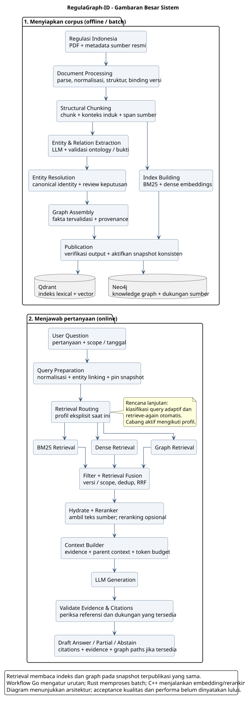
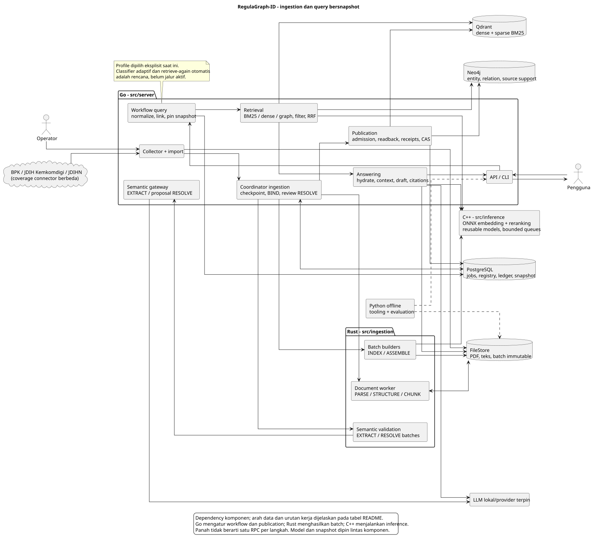

# RegulaGraph-ID

RegulaGraph-ID is a **Hybrid GraphRAG project for Indonesian regulations**. It transforms PDFs and source metadata into structure-based chunks, consistent regulation and provision identities, lexical and dense indexes, and a knowledge graph backed by source evidence. Questions are answered against a consistent corpus snapshot, with retrieved evidence assembled into context for cited answers. This README covers the architecture, component boundaries, technology choices, project structure, and local operation.

Indonesian regulations are distributed across sources, reference one another, change over time, and use different terms for the same concepts. The project aims to speed up research while making each answer traceable to its source text or article. A citation alone does not establish legal correctness.

**Status:** acquisition/import, document processing, native embedding/reranking, registry/resolution, graph assembly/publication, four retrieval profiles, and local draft answers through the CLI/API have implementations. Backend/native integrations have been tested on fixtures; an acquired PDF has passed PARSE → STRUCTURE → BIND → CHUNK. Database migration is available through the CLI. EXTRACT now includes pinned ontology vocabulary and rejects mismatched job/output context pins. The full-PDF local model test has not passed because of timeouts and invalid model output; this is not a successful extraction run. Real-corpus acceptance, gold-set quality evaluation, all required performance targets, and several advanced features **remain unfinished**. See the [development plan](doc/development-plan.md) and [real-PDF verification](doc/verification-report-real-pdf.md).

**Try it now:** the [local demo](#running-the-local-demo) runs without a database. The [full GraphRAG pipeline](#running-the-local-graphrag-pipeline) requires backend services, pinned models, and a published corpus.

**Development handoff:** the [operational continuation guide](doc/operational-handoff.md) records the current blockers, dependency order, code locations, run instructions, and evidence needed to make the full local application usable. It also separates operational readiness from quality and performance acceptance.

**Latest extraction work:** EXTRACT/RESOLVE send an explicit, producer-pinned output token cap. The optional v2 extraction schema lets the gateway compute byte offsets from unique exact quotations and adjacent context. Boundary tests pass, but a local model replay still produced four invalid locators and was rejected. Model integration remains unfinished. See [quote-extraction verification](doc/verification-report-quote-extraction.md) and [completion-budget verification](doc/verification-report-semantic-budget.md).

Validation errors now identify invalid locator fields without including source quotations. Two local correction experiments still failed source validation, so automatic model retries remain disabled. See the [feedback experiment report](doc/verification-report-extraction-feedback.md).

Further local extraction diagnostics remain unsuccessful: the same chunk timed out on a CPU-only llama.cpp run, while a copying-example prompt on Ollama repeated mentions until its output was truncated. Neither experiment changed the production prompt or acceptance targets. See the [runtime experiment report](doc/verification-report-extraction-runtime.md).

An optional local llama.cpp mode now checks the complete EXTRACT/RESOLVE prompt against the pinned context window before inference and verifies token-usage parity afterwards. A real local-model smoke test passed these checks; full-PDF extraction and quality acceptance remain unfinished. See [semantic admission verification](doc/verification-report-semantic-admission.md).

Interrupted semantic items now remain retryable instead of becoming permanently cached failures. Successful items are reused within the gateway process; optional PostgreSQL completion replay now also survives restarts and reruns semantic validation. See [durable replay](doc/semantic-completion-replay.md). See [retry verification](doc/verification-report-semantic-retry.md).

## System Overview

The main flow follows the original plan: regulations become chunks, indexes, and a knowledge graph; questions pass through retrieval, fusion, context assembly, and evidence-backed generation. Extraction reads chunks tied to source text, while the registry and publication layer maintain consistent identities, versions, and snapshots.

[](doc/system-big-picture.svg)

[Overview PlantUML source](doc/system-big-picture.puml). Click the image for the full-size view. Retrieval profiles are currently selected explicitly; adaptive query classification and automatic retrieval retries are planned. Reranking is optional, and responses may be PARTIAL or ABSTAIN.

## Detailed Architecture

Go owns workflows, registry authority, and storage commit/publication. Rust performs batch transformations; C++ runs embedding/reranking; Python runs offline. Arrows represent logical dependencies, not one RPC per step. The C01 Protobuf contracts carry identities, versions, snapshots, producers, status, and UTF-8 byte offsets across runtimes.

[](doc/architecture-overview.svg)

[PlantUML source](doc/architecture-overview.puml). Click the diagram for the full-size view.

SVGs are rendered from PlantUML and stored in the repository so GitHub can display them without a plugin. After editing a `.puml` file, regenerate both images with `java -jar .cache/plantuml/plantuml.jar -tsvg -failfast2 doc/system-big-picture.puml doc/architecture-overview.puml`; obtain the renderer from the [official PlantUML distribution](https://plantuml.com/download). Further design details: [system design](doc/system-design.md), [contracts](doc/system-contracts.md), and [storage consistency](doc/storage-consistency.md).

### Ingestion sequence

| Stage / component | Input → processing → output | Owner / location | Role and integration |
| --- | --- | --- | --- |
| 1. Acquisition | Catalog/detail URL → HTML, metadata, PDF download/hash → record/receipt + blob | Go `internal/ingestion/sources` | Automates downloads; resume/audit preserve provenance. JDIHN coverage is incomplete. |
| 2. Import/submit | Complete record + PDF → immutable copy, registration, enqueue → PARSE job | Go `workflows/acquisition_import.go`, `cmd/cli/submit_acquisition.go` | The acquisition root is separate from the artifact store. Portal metadata is not yet a canonical identity decision. |
| 3. PARSE/STRUCTURE | PDF → PDFium, normalization with offset mapping, hierarchy → text/structure batch | Rust `document/parsing`, `normalization`, `chunking/structural.rs` | Preserves pages, source bytes, articles, paragraphs, and list items. OCR and difficult layouts need additional handling. |
| 4. BIND/CHUNK | Structure + metadata → registry identity/version → chunks, parent context, token counts | Go `domain/registry.go`, `workflows/bind.go`; Rust `document/chunking` | Regulation numbers are interpreted with issuer/type/year. Chunks reference actual versions and source spans. |
| 5. EXTRACT | Chunks + ontology → LLM mention/assertion proposals → validated batch | Go semantic gateway; Rust `knowledge_graph/extraction` | Prompts guide reasoning; validators check schema, evidence, ontology, and manifests. |
| 6. RESOLVE/review | Mentions + candidates + context → LINK/DEFER proposals, review → committed decisions | Go `workflows/semantic_resolution*`, PostgreSQL; Rust `knowledge_graph/resolution` | A shared alias does not imply a shared identity. Models help resolve ambiguity; the registry remains authoritative. Full CREATE/MERGE/SPLIT support is unfinished. |
| 7. Index preparation | Selected CHUNK outputs → snapshot, vocabulary, dictionary, statistics → IndexBuildPlan | Go `indexing`; Rust `indexing` | Statistics must cover the selected source population; model/analyzer/dictionary versions are pinned before INDEX. |
| 8. INDEX/ASSEMBLE | Plan + chunks/decisions → dense/sparse vectors or graph delta → immutable batch | Rust `indexing`, `knowledge_graph/assembly`; C++ inference | The graph is assembled from validated facts and decisions. Extraction is not repeated at query time. |
| 9. Publication | All child jobs complete → validation, backend write/readback, receipts → active snapshot | Go `internal/indexing`, PostgreSQL/Qdrant/Neo4j adapters | Partial data must not become active. Ledgers, fencing, replay, and CAS coordinate storage; this is not an atomic cross-database transaction. |

### Query sequence

| Stage / component | Input → processing → output | Main location | Rationale / current limits |
| --- | --- | --- | --- |
| 1. Admission | Question + corpus/date → auth/budget/profile validation → context | `server/internal/api`, `config` | Trusted scope comes from the server. The API accepts explicit AS_OF requests; CURRENT/COMPARE and streaming are not active. |
| 2. Preparation | Context → snapshot pinning, normalization, lexical/entity lookup → query plan | `workflows`, `retrieval/query` | Each answer uses a consistent corpus view. Profiles are explicit; there is no automatic factual/relational classifier yet. |
| 3. Retrieval | Plan → dense/BM25/graph retrieval for the selected profile → sourced candidates | `retrieval`, `retrieval/graph`, adapters | Dense retrieval handles paraphrases, BM25 handles exact terms/numbers, and graph retrieval follows cross-document relationships. |
| 4. Filter/fusion | Candidates + scope/version → filtering, evidence/version deduplication, RRF → ranking | `retrieval/fusion.go`, domain boundaries | Raw scores from different engines use different scales. Date filtering does not imply all legal amendments have been modeled. |
| 5. Hydrate/rerank | Ranking → original text + optional reranking → ordered evidence | `workflows/rag_hydration.go`, `retrieval/reranking.go`, C++ | Cross-encoders add cost. Reranking is optional in the CLI; API reranking configuration is not wired yet. |
| 6. Context | Evidence + parent context + token budget → sourced prompt | `answering/context_builder.go` | Preserves parent context; evidence completeness must be measured alongside latency. |
| 7. Generation/validation | Prompt → draft claims/citations → reference and available-support validation | `answering`, inference adapters, `workflows/answer.go` | Returns draft/PARTIAL/ABSTAIN. Structural citation validity does not establish entailment for every claim. |
| 8. Response/evaluation | Result + evidence/status → API/CLI response and metrics | `api`, `cmd/cli`, `evaluation` | Sources remain inspectable. Automatic retrieval retries and full quality acceptance are unfinished. |

**Explicit Go workflows replace LangGraph.** The request path composes components within one process; ingestion uses PostgreSQL jobs/checkpoints and batch workers. This reduces runtime boundaries on the latency-sensitive path, at the cost of implementing state transitions, retries, tracing, and recovery.

## Technology Choices and Trade-offs

| Technology | Role | Why it was chosen | Trade-off / alternative |
| --- | --- | --- | --- |
| Go | API/CLI, workflows, retrieval, answering, adapters | Concurrent I/O and reusable pools; fusion/filter/context stay in one process | Requires custom orchestration; FastAPI/LangGraph offer richer prototyping support. Language choice alone does not guarantee speed. |
| Rust | Batch document, graph, and index transformations | Memory control, ownership, and CPU-intensive processing | More complex builds/interop than Python; PDF processing still uses a native library. |
| C++ + ONNX Runtime | BGE-M3 embeddings and BGE cross-encoder | Reusable sessions, CPU/CUDA, batching/admission | SDK/ABI/model exports must be pinned; alternative inference servers need comparison on the same workload. |
| PDFium + Rust tokenizer | PDF text extraction and actual token counting | Mature PDF engine; token budgets align with the model tokenizer | OCR, tables, and reading order still require dedicated work. |
| Offline Python | Corpus/model tooling and evaluation | ML/analysis ecosystem without a Python dependency in serving | Multiple languages and shared contracts must be maintained. |
| PostgreSQL | Jobs, registry, versions, review, publication ledger | Transactions, constraints, and durable audit records | Locking and queries need profiling; it is not the traversal/vector engine in this design. |
| Qdrant | Dense and sparse BM25 indexes | Two retrieval representations with metadata filtering | Generations/payloads must match the registry; pgvector/OpenSearch would change component responsibilities. |
| Neo4j | Entities, relations, source support, traversal | Inspectable relationships and paths across regulations | Adds a backend; graph value depends on correct extraction, resolution, and evidence. |
| BM25 + dense + RRF | Exact and semantic retrieval | Covers article numbers, terminology, and paraphrases; combines rankings with different score scales | More candidates/calls cost more; hybrid retrieval is not automatically more accurate. |
| Cross-encoder | Candidate reranking | Richer query-text interactions | Cost depends on pair count/length; logits are not calibrated confidence scores. |
| LLM + validator | Extraction, ambiguous resolution, draft answers | Contextual reasoning without hardcoding every language variation | Incorrect facts, cost, and nondeterminism require evidence validation, model pins, review, and evaluation. |
| Protobuf/gRPC | C01 boundaries and artifacts | Shared schemas, IDs, producers, and status across runtimes | Requires code generation and compatibility management; not an RPC for every helper. |
| Immutable FileStore | PDFs, text, batches, manifests | Hash verification, replay, and auditability | Capacity, backups, retention, and orphan cleanup need management. |
| Docker/Compose (planned) | Packaging/deployment | Reproducible dependencies | Compose still contains `services: {}`; it is not a runnable deployment stack. |

The tested BGE and LLM models are implementation candidates, not a claim that they are the best release models. Final selection requires a fixed corpus/split/workload and measured quality/latency.

## Project Structure

This tree covers **all managed component directories**, plus key configuration files and entry points. Every displayed entry has a description on the right. Each component directory has a README.md, omitted from individual rows. Child READMEs describe the many implementation and test files; this is not a list of every source file.

```text
RegulaGraph-ID/                              # Runtime, contracts, tooling, and evaluation monorepo
|-- .vscode/                                # Workspace editor settings
|   `-- settings.json                       # Project editor preferences
|-- src/                                    # Product code and shared contracts
|   |-- server/                             # Go runtime; serving and storage authority
|   |   |-- go.mod / go.sum                  # Go module dependencies/checksums
|   |   |-- cmd/                            # Executable composition roots
|   |   |   |-- api/                        # main.go: bootstrap HTTP evidence/draft answer
|   |   |   |-- cli/                        # Migrate, collect, submit, prepare/publish, query, demo
|   |   |   |-- ingestion-worker/           # Coordinator daemon: leases, retries, checkpoints
|   |   |   `-- semantic-gateway/           # Structured EXTRACT/RESOLVE model gateway
|   |   |-- internal/                       # Private server components
|   |   |   |-- domain/                     # Domain identities, invariants, validation, and DTOs
|   |   |   |-- config/                     # Configuration admission and model pins
|   |   |   |-- api/                        # HTTP transport, middleware, responses/errors
|   |   |   |   |-- routes/                 # Endpoint routing
|   |   |   |   `-- schemas/                # HTTP request/response mapping and validation
|   |   |   |-- ingestion/                 # Source acquisition and preparation in Go
|   |   |   |   `-- sources/               # Connectors, discovery, downloads, audit/receipts
|   |   |   |-- workflows/                 # Use-case sequences across domains/adapters
|   |   |   |-- indexing/                  # Inventories, write/readback, and publication
|   |   |   |-- retrieval/                 # Dense/lexical orchestration, fusion/reranking
|   |   |   |   |-- query/                 # Query normalization, analysis, and entity linking
|   |   |   |   `-- graph/                 # Graph discovery/traversal and evidence
|   |   |   |-- answering/                 # Context, generation, citation, abstention
|   |   |   `-- adapters/                  # External dependency port implementations
|   |   |       |-- inference/             # Native/LLM clients and output admission
|   |   |       |-- neo4j/                 # Graph read/write/generation/verification
|   |   |       |-- postgres/              # Registry, jobs, migrations, ledgers, snapshots
|   |   |       |-- qdrant/                # Collection, dense/sparse write/search/readback
|   |   |       |-- storage/               # FileStore/hashes and confined artifact access
|   |   |       `-- worker/                # Rust batch gRPC client
|   |   `-- gen/regulagraph/v1/             # Generated Go bindings; edit the source schema
|   |-- ingestion/                         # Rust runtime; batch transformations
|   |   |-- Cargo.toml                      # Ingestion crate manifest
|   |   |-- src/                            # Library and worker
|   |   |   |-- lib.rs                      # Module exports; no model loading/connections
|   |   |   |-- bin/                        # Worker and lexical tooling entry points
|   |   |   |   |-- regulagraph-worker.rs    # Tonic batch service bootstrap
|   |   |   |   `-- regulagraph-lexical.rs   # Vocabulary and BM25 statistics
|   |   |   |-- adapters/                   # Rust PDF/storage/inference boundaries
|   |   |   |-- domain/                     # Transformation types/invariants
|   |   |   |-- document/                   # PDFs to text, structure, and source versions
|   |   |   |   |-- parsing/                # PDF text layer and parser interfaces
|   |   |   |   |-- normalization/          # Raw-to-normalized byte mapping
|   |   |   |   |-- chunking/               # Structure, parent context, splitting, token counts
|   |   |   |   `-- versioning/             # Version and amendment-relation transformations
|   |   |   |-- knowledge_graph/            # Sourced facts to graph batches
|   |   |   |   |-- extraction/             # Model extraction and evidence admission
|   |   |   |   |-- resolution/             # Batched identity candidates/decisions
|   |   |   |   |-- assembly/               # Nodes, edges, support, and GraphDelta
|   |   |   |   |-- validation/             # Ontology/graph/provenance gates
|   |   |   |   `-- summarization/          # Graph summarization scope; see child README for status
|   |   |   |-- indexing/                   # Analyzer, dictionary, statistics, dense/sparse
|   |   |   `-- worker/                     # RPC dispatch, cancellation, output checkpoint
|   |   `-- tests/                          # Rust crate integration tests
|   |-- inference/                         # Native embedding/reranking runtime
|   |   |-- CMakeLists.txt                  # C++ build and ONNX options
|   |   |-- include/                        # Public C++ headers
|   |   |   `-- regulagraph/                # Project namespace
|   |   |       `-- inference/              # API runtime/batching/embedding/reranker
|   |   |-- src/                            # C++ implementation, server, and native tests
|   |   `-- tokenizer/                     # Rust tokenizer exposed to C++ through a C ABI
|   `-- contracts/                         # Cross-language schema sources
|       |-- schema-lock.json               # C01 compatibility baseline
|       |-- jsonschema/                    # Structured output model/extraction/resolution
|       `-- proto/                         # Protobuf source of truth
|           `-- regulagraph/               # Contract namespace
|               `-- v1/                    # Documents/graph/jobs/evidence/inference/answers
|-- configs/                               # Versioned configuration and shared policies
|   |-- prompts/                           # Model prompts pinned by version/hash
|   |-- benchmark-targets.yaml             # Single source of required benchmark targets
|   |-- ontology-v1.jsonc                  # Allowed entities, predicates, and qualifiers
|   |-- sources.txt / listings.txt         # Official source detail/catalog seeds
|   `-- demo.Modelfile                     # Ollama demo profile
|-- migrations/                            # Versioned control-plane SQL
|-- deployment/                            # Planned deployment packaging/wiring
|   `-- docker-compose.yml                 # Empty services; not a startup stack yet
|-- evaluation/                            # Offline evaluation of production outputs
|   |-- runner.py                          # Eligibility, run bundle, required gates
|   |-- datasets/                          # Schema, loader, gold annotation; not raw corpus
|   |-- experiments/                       # Comparison profiles and configuration
|   `-- metrics/                           # Retrieval/graph/answer/citation/runtime
|-- tooling/                               # Offline corpus/model tools
|   |-- corpus/                            # Demo sample, corpus profile, gold/review queue
|   `-- models/                            # Download/export/parity bundle inference
|-- tests/                                 # Cross-component/language verification
|   |-- fixtures/                          # Deterministic inputs and negative cases
|   |-- unit/                              # Python tooling/evaluation unit tests
|   |-- integration/                       # Wire and runtime integration
|   `-- end_to_end/                        # End-to-end flows and acceptance
|-- scripts/                               # Build, code generation, and repository checks
|   |-- start_demo.ps1                      # Start the foreground preview
|   |-- build_native.ps1                    # Build inference with operator-provided SDKs
|   |-- generate_contracts.py              # Generate bindings from Protobuf
|   `-- check_contracts.py                 # Check baseline compatibility
|-- doc/                                   # Design, operating guides, verification evidence
|   |-- system-big-picture.puml / .svg       # High-level system flow source and image
|   |-- architecture-overview.puml / .svg    # Detailed component dependency source and image
|   |-- decisions/                         # Architecture decisions and historical trade-offs
|   |-- interview/                         # Flow, math, architecture, and code-map explanations
|   |-- architecture.md                    # Detailed architecture
|   |-- development-plan.md                # Milestone status and work dependencies
|   |-- verification.md                    # Input/process/output verification protocol
|   `-- benchmark-policy.md                # Acceptance and target-change policies
|-- data/                                  # Local inputs/corpus and acquisition metadata
|-- artifacts/                             # Run outputs, models, exports, verification evidence
|-- .env.example                           # Environment reference; .env is not auto-loaded
|-- .gitignore                             # Excludes secrets, corpus, caches, and builds
|-- AGENTS.md                              # Scope, documentation, and verification rules
|-- PLAN.MD                                # Original plan; current status in development-plan
|-- Cargo.toml / Cargo.lock                # Rust workspace and lockfile
|-- go.work / go.work.sum                   # Go workspace and checksums
|-- pyproject.toml                         # Offline Python packaging
`-- README.md                              # Main project guide
```

Runtime-generated directories include `data/acquisition/{records,blobs,...}` for collector output, `artifacts/interview-demo` for demo exports, `artifacts/models` for weights/manifests, `artifacts/verification/<run-id>` for verification evidence, `.cache` for local dependencies/builds, and `target` for Cargo output. Their contents are not all tracked by Git. The `gen` bindings are generated output.

`data` holds operational inputs/corpus files; `evaluation/datasets` holds evaluation contracts and labeled data. Use `git ls-files` to list all tracked files. Child READMEs define scope, integration, and status; a directory's existence does not mean all planned work is complete. Read [AGENTS.md](AGENTS.md) before adding components.

## Running the Local Demo

Run all PowerShell examples from the repository root. The demo provides **BM25 + LLM draft answers over real PDFs**, without Neo4j, Qdrant, the Rust chunker, or C++ embeddings in the request path.

### Prerequisites and startup

Install the Go version specified in `go.work` (Go 1.26, toolchain 1.26.8), Python 3.11+, and prepare complete collector records/PDFs in `data/acquisition`. For generation, run Ollama with `qwen2.5:7b`; SearchOnly does not require a model.

```powershell
python -m pip install -e .
# Only if the weights are not available yet; requires internet access.
ollama pull qwen2.5:7b
powershell -ExecutionPolicy Bypass -File scripts/start_demo.ps1
```

Open **http://127.0.0.1:8096**. The script prepares a sample once, builds Go, and runs the server in the foreground. If Ollama is not running, launch the application or run `ollama serve` in another terminal. For search without generation:

```powershell
powershell -ExecutionPolicy Bypass -File scripts/start_demo.ps1 -SearchOnly
```

Example question: “Apa saja hak subjek data pribadi?” (“What rights do personal data subjects have?”). Ensure the sample contains relevant documents. The UI displays evidence/PDFs; model responses are drafts. The script reuses an active process in the same mode, so code changes require a restart.

### Rebuilding the sample and stopping the server

Use a new output directory to retain the original PDFs and previous sample. This processes local downloads without downloading them again:

```powershell
python -m tooling.corpus.prepare_demo --acquisition data/acquisition --out artifacts/interview-demo-v2 --documents 24 --max-pages 150
go run ./src/server/cmd/cli demo -corpus artifacts/interview-demo-v2 -acquisition data/acquisition -listen 127.0.0.1:8096 -model regulagraph-demo:latest
```

Stop the previous server if it uses the same port. Check `report.json` and `SHA256SUMS`; skipped documents remain recorded. The startup script uses the default directory; use the CLI above for an alternative sample. Sample size is not the benchmark workload.

Press **Ctrl+C** in the server terminal to stop it. For a background process, verify both its PID **and executable path** before using `Stop-Process -Id <PID>`; do not terminate all Go/Ollama processes. Closing the browser does not stop the server. Details: [local demo](doc/interview-demo.md).

## Corpus Acquisition and Audit

The selected sources are BPK, JDIH Kemkomdigi, and JDIHN Nasional. Coverage varies; dynamic search and JDIHN member PDFs have not been fully verified.

```powershell
# Optional: discover URLs before downloading PDFs.
go run ./src/server/cmd/cli discover -input configs/listings.txt -max-pages 200 -interval 1s -out data/acquisition
# Choose detail seeds or the queue produced by discovery.
go run ./src/server/cmd/cli collect -input configs/sources.txt
# Alternative: collect -input data/acquisition/queue.txt
go run ./src/server/cmd/cli audit -out data/acquisition -workers 8
```

The collector stores actual PDFs, metadata, receipts, and hashes; subsequent runs support resuming. `-refresh` checks sources again and is not necessary merely to rebuild indexes. Use one writer per acquisition root. Inspect incomplete/error/deferred states rather than PDF presence alone. Limits, retry options, and connector coverage: [acquisition](doc/acquisition.md).

## Running the Local GraphRAG Pipeline

This path is **not yet a single command from a clean checkout**. Operators must prepare backend services, migrations, pinned models/prompts/ontology, and the source inventory. Compose does not start the dependencies yet. Replace `<...>` placeholders with actual values/artifacts, not fixture hashes.

### 1. Build and dependencies

```powershell
go build ./src/server/...
cargo fetch --locked
cargo build -p regulagraph-ingestion --bins --locked
# SDKs/paths are provided by the operator.
./scripts/build_native.ps1 -OrtRoot .cache/ort-wheel-sdk -DependencyPrefixes .cache/protobuf-install,.cache/grpc-install -Protoc .cache/contracts-tools/protoc/bin/protoc.exe
```

C++ requires C++17, CMake 3.20+, protobuf/protoc 34.1, gRPC 1.76, and ONNX Runtime 1.22.0 with compatible ABIs. The native build script uses Cargo offline after dependencies have been cached. A default CMake build without the model runtime is not a complete embedding service. BGE export/bundling, manifests, tokenizers, and runtime arguments: [native inference](doc/native-inference.md). Weights are not stored in Git.

Prepare local PostgreSQL, Qdrant, and Neo4j services. Apply [migrations](migrations/README.md) in order before starting the runtime: run `go run ./src/server/cmd/cli migrate -dir migrations -timeout 5m` with the appropriate `REGULAGRAPH_POSTGRES_DSN`. The command uses checksums, an advisory lock, and a transaction per file; replay does not duplicate changes. There is no automatic reset/down operation. Keep test databases separate. Configuration is documented in [.env.example](.env.example); **.env is not loaded automatically**. Set `$env:...` in each process's terminal; never commit credentials.

### 2. Start ingestion and model services

| Startup order | Command / guide | Dependencies that must match |
| --- | --- | --- |
| Native inference | Built C++ executable; [arguments](doc/native-inference.md) | Model manifests/hashes, CPU/CUDA, port; models load once |
| Semantic gateway + LLM | `go run ./src/server/cmd/semantic-gateway`; [gateway](src/server/cmd/semantic-gateway/README.md) | Endpoint, model/version/weights/tokenizer, prompt/schema/ontology, budgets |
| Rust worker | `target/debug/regulagraph-worker.exe`; [worker](src/ingestion/src/worker/README.md) | PDFium library/hash/version, tokenizer/hash, artifact root, semantic/native endpoints/manifests |
| Go coordinator | `go run ./src/server/cmd/ingestion-worker`; [coordinator](src/server/cmd/ingestion-worker/README.md) | DSN, worker endpoint, shared root, owner/scope, ontology, candidate policy, build/jurisdiction |

Go's `REGULAGRAPH_ARTIFACTS_DIR` and Rust's `REGULAGRAPH_WORKER_ARTIFACT_ROOT` must refer to the same store. Go's `REGULAGRAPH_WORKER_ENDPOINT` must match the Rust listener. RESOLVE/INDEX/ASSEMBLE are enabled explicitly; enabling a flag does not create an inventory or publication. Run services in separate foreground terminals. Local models do not require a cloud API key; protected backends still require local credentials.

To prepare documents and indexes while extraction is deferred, start the coordinator with `REGULAGRAPH_EXTRACT_ENABLED=false` (default `true`). Pending extraction jobs remain unchanged; restart with `true` to resume normal claims. This flag affects only that coordinator, so other enabled coordinators can still claim extraction work. It does not make the graph ready or change benchmark requirements.

### 3. Import and process sources

```powershell
go run ./src/server/cmd/cli submit -request data/ingestion-request.json -job-id job:document-example -acquisition-record data/acquisition/records/RECORD_HASH.json -acquisition-root data/acquisition
```

The IngestionRequest ProtoJSON must contain the corpus, INGEST operation, idempotency key, and actual producer; the importer fills empty sources/observations. Follow the [import contract](doc/acquisition-import.md). The coordinator runs PARSE → STRUCTURE → BIND → CHUNK → EXTRACT. Metadata/identity conflicts require review. Graph construction requires RESOLVE and reviewed decisions: [resolution](doc/semantic-resolution.md), [review](doc/semantic-review.md). Successful submission means the job is durable, not that the corpus is search-ready.

### 4. Dense/BM25 indexes

Sequence: **committed CHUNK → prepare-snapshot → vocabulary → prepare-dictionary → freeze → prepare-index → all INDEX jobs STAGED → publish-index**.

```powershell
go run ./src/server/cmd/cli prepare-snapshot -corpus corpus:example -publication publication:example -generation generation:example -auth-scope operator:corpus -source 'job:document=artifact:document-batch:HASH' -out artifacts/preparation-example
# Run vocabulary/dictionary/freeze on snapshot.pb and all source-*.pb files.
# prepare-index uses dictionary/statistics refs and a pinned model manifest.
# Wait until all child INDEX jobs are STAGED.
go run ./src/server/cmd/cli publish-index -corpus corpus:example -publication publication:example -profile hybrid
```

The full two-pass commands are in [lexical-population](doc/lexical-population.md); `prepare-index`, binary `embedding-model.pb`, and scheduling/retries are covered in [index-source-publication](doc/index-source-publication.md). All passes must use the same population/snapshot. Rust requires the native endpoint and binary model manifest/hash; Go requires `REGULAGRAPH_INDEX_ENABLED=true`. This publication activates dense/BM25 retrieval, not graph retrieval yet.

Example intermediate steps for the **single** source selected above (for multiple sources, repeat `--source-ref` in vocabulary and freeze):

```powershell
$prep = 'artifacts/preparation-example'
$scope = 'operator:corpus'
target/debug/regulagraph-lexical.exe vocabulary --artifacts $env:REGULAGRAPH_ARTIFACTS_DIR --snapshot "$prep/snapshot.pb" --auth-scope $scope --source-ref "$prep/source-001.pb" --output "$prep/vocabulary.txt"
$vocabularyHash = (Get-FileHash "$prep/vocabulary.txt" -Algorithm SHA256).Hash.ToLowerInvariant()
go run ./src/server/cmd/cli prepare-dictionary -vocabulary "$prep/vocabulary.txt" -vocabulary-sha256 $vocabularyHash -corpus corpus:example -output "$prep/dictionary-ref.pb"
target/debug/regulagraph-lexical.exe freeze --artifacts $env:REGULAGRAPH_ARTIFACTS_DIR --snapshot "$prep/snapshot.pb" --auth-scope $scope --source-ref "$prep/source-001.pb" --dictionary-ref "$prep/dictionary-ref.pb" --statistics-id statistics:example --k1 1.2 --b 0.75 --output "$prep/statistics-ref.pb"
$modelManifest = 'artifacts/models/bge-m3-fp16-ort1220/model.pbjson'
$modelHash = (Get-FileHash $modelManifest -Algorithm SHA256).Hash.ToLowerInvariant()
go run ./src/server/cmd/cli prepare-index -snapshot-directory $prep -publication publication:example -collection regulagraph_example -auth-scope $scope -ontology-version id-regulation-ontology-v1 -dictionary-ref "$prep/dictionary-ref.pb" -statistics-ref "$prep/statistics-ref.pb" -model-manifest $modelManifest -model-sha256 $modelHash
```

Stop the sequence if any command returns a nonzero exit code. These hashes bind local bytes; they do not prove that a model came from a trusted publisher. The bundle must still pass export admission/receipt checks. Replace model paths, ontology versions, and identities for your run. The `.pb` files contain binary C01 protobuf messages. After `prepare-index`, configure Rust's native INDEX path with the resulting `embedding-model.pb` and its binary hash, then run child jobs until STAGED and call `publish-index`.

### 5. Build the graph over published indexes

```powershell
go run ./src/server/cmd/cli prepare-graph -corpus corpus:example -publication publication:graph-example -snapshot snapshot:graph-example -base-snapshot snapshot:index-example -auth-scope operator:corpus -timeout 5m
# Set REGULAGRAPH_ASSEMBLE_ENABLED=true on the coordinator; wait for all children to be STAGED.
go run ./src/server/cmd/cli publish-graph -corpus corpus:example -publication publication:graph-example -snapshot snapshot:graph-example -generation graph-generation:example -auth-scope operator:corpus -timeout 5m
```

Every index member must have a successful RESOLVE output, valid artifacts, and valid authority; DEFER/missing sources are not skipped. Configure the DSN/store/ontology/Qdrant/Neo4j according to [prepare-graph](doc/graph-preparation.md), [ASSEMBLE](doc/graph-job-execution.md), and [publish-graph](doc/graph-publication.md). The graph snapshot inherits verified indexes; activation waits for all receipts.

### 6. API and queries

Example dense/BM25 API configuration after corpus publication:

```powershell
$env:REGULAGRAPH_POSTGRES_DSN = '<local DSN>'
$env:REGULAGRAPH_ARTIFACTS_DIR = '<shared artifact root>'
$env:REGULAGRAPH_QDRANT_URL = 'http://127.0.0.1:6333'
$env:REGULAGRAPH_QUERY_NATIVE_ENDPOINT = '127.0.0.1:50054'
$env:REGULAGRAPH_QUERY_CORPUS_ID = 'corpus:example'
$env:REGULAGRAPH_API_AUTH_SCOPE = 'operator:corpus'
$env:REGULAGRAPH_API_PROFILE = 'hybrid'
$env:REGULAGRAPH_BUILD_ID = 'local-dev'
$env:REGULAGRAPH_API_LISTEN = '127.0.0.1:8097'
$tokenBytes = New-Object byte[] 32
$tokenGenerator = [Security.Cryptography.RandomNumberGenerator]::Create()
$tokenGenerator.GetBytes($tokenBytes)
$tokenGenerator.Dispose()
$env:REGULAGRAPH_API_TOKEN = [Convert]::ToBase64String($tokenBytes)
go run ./src/server/cmd/api
```

`/livez` checks process liveness; `/readyz` requires a bearer token for readiness checks. `/v1/evidence` accepts a question, corpus, profile, and AS_OF date. Graph profiles require route configuration/hash and Neo4j credentials matching the catalog; graph-only retrieval does not require embeddings. Full request/error examples: [evidence API](doc/evidence-api.md).

Draft answers at `/v1/questions` require `REGULAGRAPH_API_ANSWERS=true` and a pinned generator. Follow [local-answer](doc/local-answer.md) for model, tokenizer, prompt, and token budgets. The `query-evidence` CLI offers reranker/generation options: [guide](doc/query-evidence.md). The evidence API can run without a generator.

Example request from a second terminal using the same local token:

```powershell
$headers = @{ Authorization = "Bearer $env:REGULAGRAPH_API_TOKEN" }
Invoke-RestMethod http://127.0.0.1:8097/readyz -Headers $headers
$question = @{
  corpus_id = 'corpus:example'
  question = 'Apa ketentuan izin usaha?'
  response_mode = 'RESPONSE_MODE_COMPLETE'
  requested_profile = 'RETRIEVAL_PROFILE_HYBRID_RAG'
  temporal_scope = @{
    mode = 'TEMPORAL_MODE_AS_OF'
    effective_at = @{ year = 2026; month = 1; day = 1 }
    unresolved_policy = 'UNRESOLVED_POLICY_REPORT'
  }
} | ConvertTo-Json -Depth 5
Invoke-RestMethod http://127.0.0.1:8097/v1/evidence -Method Post -Headers $headers -ContentType application/json -Body $question
```

Tokens and environment variables are not automatically shared between terminals. Choose an actual date and corpus. PARTIAL/NONE responses expose evidence limitations; they do not indicate a complete answer.

### 7. Stop, resume, and rebuild

Stop the API/coordinator with Ctrl+C, followed by workers/models that you started for the session. The coordinator stops claiming new jobs and cancels RPCs; checkpoints and leases determine recovery. Restarting does not require deleting databases or blobs.

| Need | Action | Preserved state |
| --- | --- | --- |
| Restart the application | Start dependencies/processes with the same configuration; check readiness | Corpus, registry, checkpoints, published snapshot |
| Update downloads | Discover/collect, audit; refresh when needed | Observation history and verified PDFs |
| Rebuild the demo | Use a new output directory and `demo -corpus ...` | PDFs and previous samples |
| Change parser/metadata policy | Use a new job/idempotency key and producer; rerun PARSE/STRUCTURE/BIND/CHUNK/review | Historical artifacts and decisions |
| Change model/chunk/analyzer | Use a new publication/generation and complete source inventory; compute population-matched statistics; INDEX/publish | The previous snapshot stays active until the target is ready |
| Rebuild the graph | Ensure valid or reprocessed EXTRACT/RESOLVE dependencies, complete ASSEMBLE, and create a new publication | Historical decisions and other sources' support; reuse must pass reaffirmation |

**Retries** use the same input/IDs; **changed inputs** require new identities/pins. Preparation outputs are not overwritten: use a new directory after a partial write. Full incremental equivalence and garbage collection remain unfinished. Snapshot membership comes from verified inventories, not every PDF found on disk.

## Evaluation, Reliability, Observability, and Scalability

| Area | Mechanisms | Evidence / remaining work |
| --- | --- | --- |
| Evaluation | An offline runner evaluates eligibility/gates from production outputs; retrieval/graph/answer/citation quality is measured separately | Human gold labels, pinned corpus/split/model/prompt/config, acceptance across four profiles; mocks do not prove model quality |
| Reliability | Immutable artifacts/hashes, checkpoints, leases/fencing, source authority, receipts, publication CAS | Corpus-wide failure/recovery, incremental/full rebuild equivalence, retention/GC |
| Observability | Job status/checkpoints, manifests, raw verification logs, evaluation telemetry, explicit errors | End-to-end tracing/metrics/dashboard coverage; production monitoring is unfinished |
| Scalability | Batch RPCs, reusable pools/models, byte/token/concurrency limits, query/bulk lanes | Reference load tests, p50/p95/p99, queue time, throughput, RSS/VRAM; automatic partitioning is incomplete |
| System design | Go authority, Rust transformation, C++ inference, contracts, and snapshots | Boundary tests when schema/model/scope/publication/evidence changes |

Required numerical targets are defined only in [benchmark-targets.yaml](configs/benchmark-targets.yaml). **REQUIRED_UNMEASURED/NOT_MEASURED does not mean an achieved SLA.** Do not lower targets, workloads, or denominators without the owner's approval; follow the [benchmark policy](doc/benchmark-policy.md). Release hardware and the final model selection have not been finalized.

## Testing and Contributing

```powershell
go test ./src/server/...
go vet ./src/server/...
cargo test -p regulagraph-ingestion --lib --locked
python -m unittest discover -s tests/unit
python scripts/check_contracts.py
```

Opt-in database/native/model tests use the environment settings described in their tests/reports; **SKIP is not an integration PASS**. Native CTest runs through the build script when the SDKs are available. Raw logs, toolchain details, fingerprints, fixtures, and exit codes are stored in `artifacts/verification/<run-id>`; summaries are tracked in `doc/verification-report-*.md`. Passing unit tests/builds does not establish quality or performance acceptance.

Update the root README after a coherent subtask changes status, architecture, commands, prerequisites, or structure. Update contracts with their implementation; preserve file headers describing functionality, integration, and performance. Use an independent reviewer for critical boundaries and proportionate checks for routine documentation. Keep commits focused on independently reviewable behaviors/components.

References: [development plan](doc/development-plan.md), [implementation guide](doc/implementation-guide.md), [verification](doc/verification.md), [architecture](doc/architecture.md), [interview](doc/interview/README.md), [PLAN.MD](PLAN.MD), [references](doc/reference.md), [AGENTS.md](AGENTS.md).
